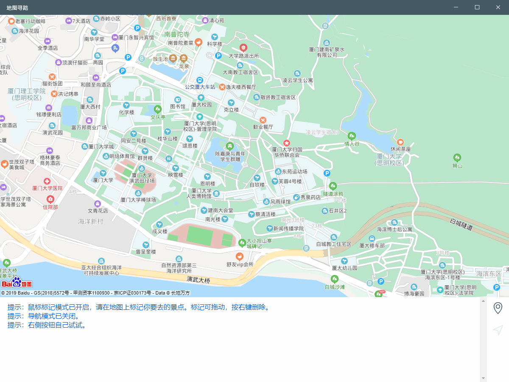
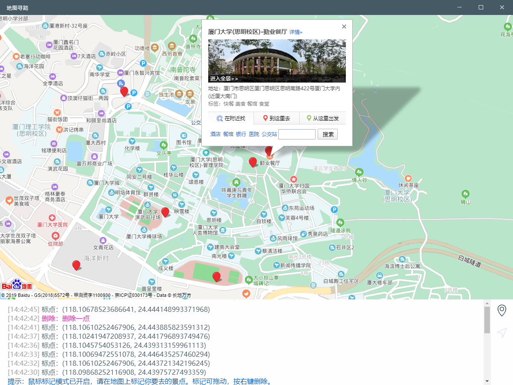
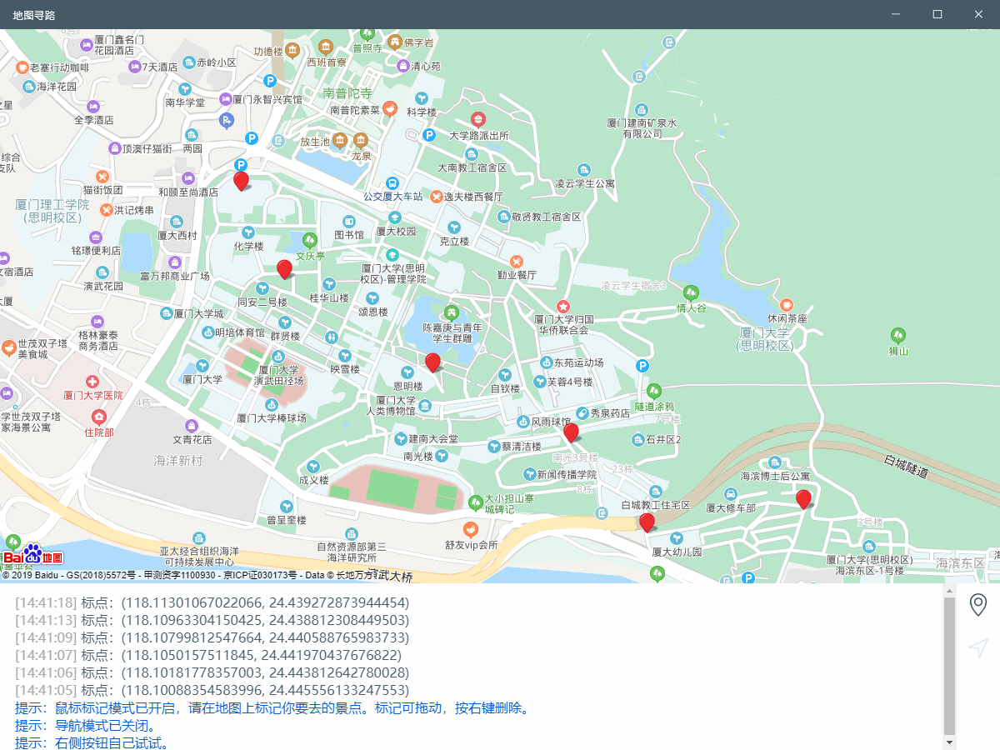
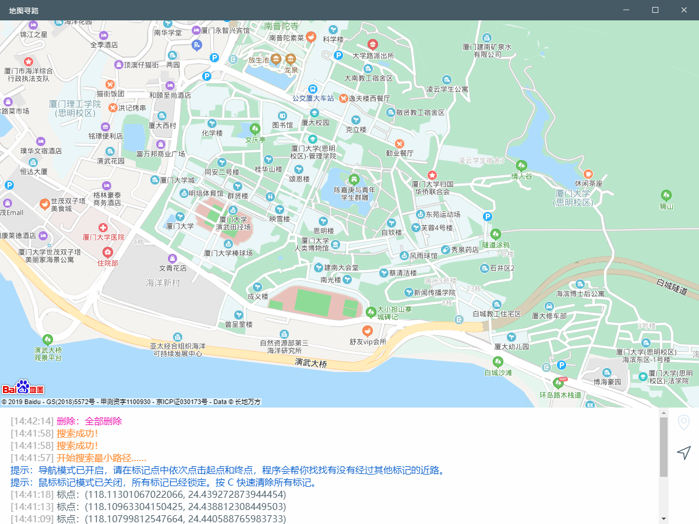
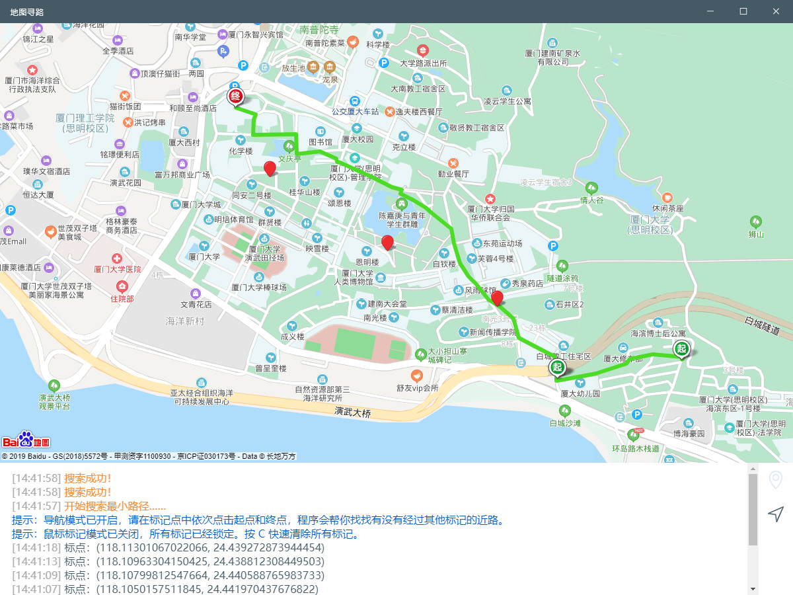

# 作业：寻找路径

## 一、配置

```
$ npm install
$ electron .
```

## 二、功能

1. 具有地图的所有正常功能（缩放，定位……）

   通过百度 API 实现了地图的展示。
   
   

1. 选点构建距离网

   点击标点按钮后即可开始鼠标标点，并构建标点之间的有向网，权值是**步行导航距离**。右键删除标点。
   
   

1. 寻找网中的最短路径

   实现了 dijkstra 算法，在给定的网中选择到达两点的最短路径（可能只通过首位两点）。
   

   关键算法概览：

   ```javascript
   // Dijkstra 算法
   var dijkstra = function(sourceV, adjMatrix) {
     let set = [],
       path = [],
       dist = [];
     distCopy = [];
     vertexNum = adjMatrix.length;

     let temp,
       u,
       count = 0;

     // 初始化
     for (let i = 0; i < vertexNum; i++) {
       distCopy[i] = dist[i] = Infinity;
       set[i] = false;
     }
     distCopy[sourceV] = dist[sourceV] = 0;

     while (count < vertexNum) {
       u = distCopy.indexOf(Math.min.apply(Math, distCopy));
       set[u] = true;
       distCopy[u] = Infinity;

       for (let i = 0; i < vertexNum; i++) {
         if (!set[i] && (temp = dist[u] + adjMatrix[u][i]) < dist[i]) {
           distCopy[i] = dist[i] = temp;
           path[i] = u;
         }
       }
       count++;
     }

     return {
       path: path,
       dist: dist
     };
   };

   // 计算最短路径
   var searchPath = function(v, d, adjMatrix) {
     let graph = dijkstra(v, adjMatrix),
       path = graph.path,
       dist = graph.dist;

     let prev = path[d],
       queue = [],
       str = "";

     queue.push(d);

     let n = 0;
     const MAX_ITER = 900; // 限制最大迭代次数

     while (prev != v) {
       n++;
       if (n > MAX_ITER) return [-1]; // 防止失败时进入死循环
       queue.push(prev);
       prev = path[prev];
     }
     queue.push(v);

     for (let j = queue.length - 1; j >= 0; j--) {
       str += queue.pop() + "->";
     }
     // console.log('路径', str);
     let arr = str.split("->");
     if (str.endsWith("->")) {
       arr.pop();
     }
     let rarr = []; // 字符串数组转int数组
     for (let i = 0; i < arr.length; i++) {
       rarr.push(parseInt(arr[i]));
     }
     return rarr;
   };
   ```
